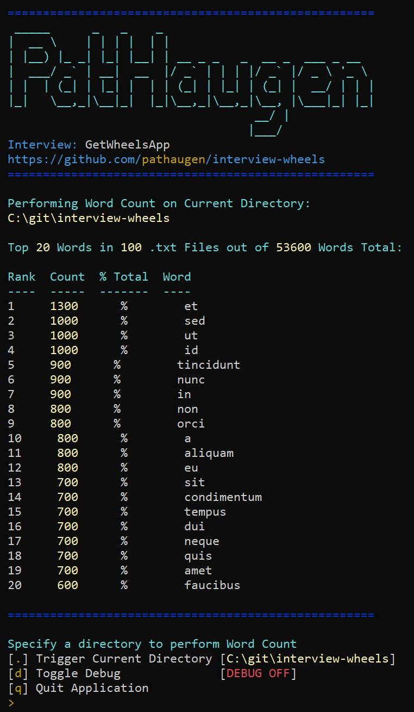

interview-wheels
================

[](https://circleci.com/gh/pathaugen/interview-wheels)
[](https://travis-ci.com/pathaugen/interview-wheels)
[](https://ci.appveyor.com/project/PatrickHaugen/interview-wheels/branch/master)

[](https://coveralls.io/github/pathaugen/interview-wheels?branch=master)
[](https://codeclimate.com/github/pathaugen/interview-wheels/maintainability)
[](https://codeclimate.com/github/pathaugen/interview-wheels/test_coverage)

interview-wheels: wheels interview question expanded to a public repo.



Word Counter
============

Hi! Welcome to the coding challenge: **Word Counter**

Taking a specified directory such as _"/home/username"_ search recursively down any/all subdirectories for all files ending in .txt count each instance of any/all words and total them all up.

**Example User Input:**
```
/home/username
```

**Example Response:**
```
Count   Word
-----   ----
4873    the
3918    a
312     apple
.       .
```

**Rules:**
* Assume UTF-8 encoded simple text.
* Avoid using libraries and if you use any, please justify their use.
* Dependencies need to be managed if you use any external libraries.
* Solution must be able to be readily run or deployed and of production quality.

Building Application (Windows)
------------------------------

1. Install Go:
   * https://golang.org/dl/
   * Recommend C:\Go on Windows
   * Test Go Installation:
     * > go version
2. Setup Go:
   * Create File Structure:
     * C:\go-work\bin
     * C:\go-work\pkg
     * C:\go-work\src
   * Check Environment Variables:
     * GOROOT: C:\Go
     * GOPATH: C:\go-work
3. Setup Git:
   * Install Git:
     * https://git-scm.com/
   * Test Git Installation:
     * `> git --version`
4. Build and Run Application:
   * Open Command Prompt
   * > mkdir c:\git
   * > cd c:\git
   * > git clone https://github.com/pathaugen/interview-wheels.git
   * > cd c:\git\interview-wheels
   * > go build
   * interview-wheels.exe

 Related Links
 -------------
 * https://github.com/pathaugen/
 * https://circleci.com/gh/pathaugen/
 * https://travis-ci.com/pathaugen/
 * https://www.linkedin.com/in/patrickhaugen/
